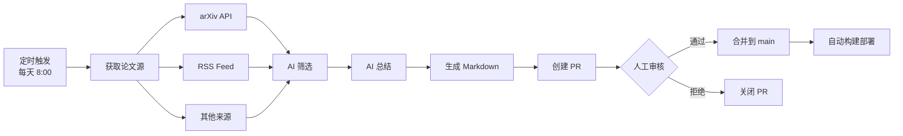

# AI Agent 架构设计方案

## 推荐方案：GitHub Actions + 人工审核流程

### 工作流程



### 为什么选择 GitHub Actions？

#### ✅ 优势
1. **零成本运营**
   - 公开仓库：无限分钟数
   - 私有仓库：2000分钟/月免费
   - 你的场景：每天运行5-10分钟，月消耗 ~300 分钟

2. **完美集成**
   - 直接提交到仓库
   - 自动触发 GitHub Pages 部署
   - PR 审核机制（避免垃圾内容）

3. **安全可靠**
   - GitHub Secrets 管理 API 密钥
   - 运行日志完整记录
   - 失败自动通知

4. **维护简单**
   - 无需管理服务器
   - 代码即配置（.github/workflows/*.yml）
   - 社区生态丰富

#### ⚠️ 注意事项
- 单次运行时限：6小时（足够用）
- 如果处理大量论文，注意并发限制
- API 调用成本（OpenAI/Anthropic）需要你自己承担

---

## 技术架构

### 1. 目录结构

```
.github/
└── workflows/
    ├── fetch-papers.yml          # 主工作流
    └── manual-trigger.yml        # 手动触发（测试用）

scripts/
├── agent/
│   ├── fetcher.js               # 获取论文
│   ├── filter.js                # AI 筛选
│   ├── summarizer.js            # AI 总结
│   ├── generator.js             # 生成 Markdown
│   └── config.js                # 配置（感兴趣的领域、关键词等）
└── package.json
```

### 2. GitHub Actions 工作流示例

```yaml
# .github/workflows/fetch-papers.yml
name: Auto Fetch and Summarize Papers

on:
  schedule:
    - cron: '0 0 * * *'  # 每天 UTC 00:00 (北京时间 8:00)
  workflow_dispatch:     # 支持手动触发

jobs:
  fetch-papers:
    runs-on: ubuntu-latest
    permissions:
      contents: write
      pull-requests: write

    steps:
      - name: Checkout repository
        uses: actions/checkout@v4

      - name: Setup Node.js
        uses: actions/setup-node@v4
        with:
          node-version: '20'

      - name: Install dependencies
        run: |
          cd scripts
          npm install

      - name: Fetch and process papers
        env:
          OPENAI_API_KEY: ${{ secrets.OPENAI_API_KEY }}
          # 或使用 ANTHROPIC_API_KEY: ${{ secrets.ANTHROPIC_API_KEY }}
        run: |
          cd scripts
          node agent/main.js

      - name: Create Pull Request
        uses: peter-evans/create-pull-request@v6
        with:
          token: ${{ secrets.GITHUB_TOKEN }}
          commit-message: 'chore: add AI-curated papers'
          branch: ai-papers-${{ github.run_number }}
          title: '📄 AI Curated Papers - ${{ github.run_number }}'
          body: |
            ## 🤖 AI 自动筛选的论文

            本PR由AI agent自动生成，包含今日筛选的优质论文。

            **请在合并前review以下内容：**
            - [ ] 论文质量是否符合标准
            - [ ] 摘要总结是否准确
            - [ ] 标签分类是否合理
            - [ ] 格式是否正确

            **统计信息：**
            - 扫描论文数: XX 篇
            - 筛选通过: XX 篇
            - 生成时间: ${{ github.run_id }}
          labels: 'automated, papers'
          reviewers: qiankemeng  # 你的 GitHub 用户名
```

### 3. Agent 核心代码示例

#### fetcher.js - 获取论文
```javascript
const axios = require('axios');

// 从 arXiv 获取论文
async function fetchArxivPapers(categories = ['cs.CV', 'cs.AI'], maxResults = 50) {
  const query = categories.map(c => `cat:${c}`).join('+OR+');
  const url = `http://export.arxiv.org/api/query?search_query=${query}&start=0&max_results=${maxResults}&sortBy=submittedDate&sortOrder=descending`;

  const response = await axios.get(url);
  const papers = parseArxivXML(response.data);

  return papers;
}

// 从其他来源获取
async function fetchFromRSS(feedUrl) {
  // 实现 RSS 解析
}

module.exports = { fetchArxivPapers, fetchFromRSS };
```

#### filter.js - AI 筛选
```javascript
const OpenAI = require('openai');

const client = new OpenAI({
  apiKey: process.env.OPENAI_API_KEY
});

async function filterPapers(papers, criteria) {
  const prompt = `
你是一个AI研究助手，专注于多模态学习领域。
请从以下论文中筛选出值得深入阅读的高质量论文。

筛选标准：
${JSON.stringify(criteria, null, 2)}

论文列表：
${papers.map((p, i) => `${i+1}. ${p.title}\n摘要: ${p.summary}`).join('\n\n')}

请返回JSON格式，包含通过筛选的论文ID和理由：
[
  { "id": 1, "reason": "创新性强，提出了..." },
  ...
]
`;

  const response = await client.chat.completions.create({
    model: 'gpt-4o',  // 或使用 gpt-4o-mini 降低成本
    messages: [{ role: 'user', content: prompt }],
    response_format: { type: 'json_object' }
  });

  const result = JSON.parse(response.choices[0].message.content);
  return result.papers;
}

module.exports = { filterPapers };
```

#### summarizer.js - AI 总结
```javascript
async function summarizePaper(paper) {
  const prompt = `
请用中文总结以下论文，包括：
1. 核心创新点（2-3句话）
2. 主要方法（3-4句话）
3. 实验结果亮点（2-3句话）
4. 个人评价（1-2句话）

论文标题: ${paper.title}
摘要: ${paper.summary}

请以Markdown格式输出。
`;

  const response = await client.chat.completions.create({
    model: 'gpt-4o-mini',  // 总结用mini就够了
    messages: [{ role: 'user', content: prompt }]
  });

  return response.choices[0].message.content;
}

module.exports = { summarizePaper };
```

#### generator.js - 生成 Markdown
```javascript
const fs = require('fs');
const path = require('path');

function generateMarkdown(paper, summary) {
  const slug = generateSlug(paper.title);
  const date = new Date().toISOString().split('T')[0];

  const content = `---
title: "${paper.title}"
date: "${date}"
summary: "${paper.summary.substring(0, 200)}..."
tags: ${JSON.stringify(paper.tags)}
venue: "arXiv Preprint"
status: "preprint"
authors:
${paper.authors.map(a => `  - name: "${a}"`).join('\n')}
arxiv: "${paper.arxivUrl}"
pdf: "${paper.pdfUrl}"
---

# ${paper.title}

> 📄 论文链接: [arXiv](${paper.arxivUrl})

## AI 生成摘要

${summary}

## 原始摘要

${paper.summary}

---

*本文由AI agent自动筛选和总结，请以原论文为准。*
`;

  const filePath = path.join(
    __dirname,
    '../../src/content/blog/posts/papers',
    `${slug}.zh.md`
  );

  fs.writeFileSync(filePath, content);

  return filePath;
}

module.exports = { generateMarkdown };
```

#### config.js - 配置
```javascript
module.exports = {
  // 感兴趣的 arXiv 分类
  arxivCategories: [
    'cs.CV',  // Computer Vision
    'cs.AI',  // Artificial Intelligence
    'cs.LG',  // Machine Learning
    'cs.CL',  // Computation and Language
  ],

  // 筛选标准
  filterCriteria: {
    keywords: [
      '多模态', 'multimodal',
      '视频理解', 'video understanding',
      '大模型', 'large language model',
      '智能体', 'agent'
    ],

    excludeKeywords: [
      'medical', '医疗',  // 排除医疗领域
      'finance', '金融'   // 排除金融领域
    ],

    minCitationPotential: 'high',  // AI评估引用潜力

    venues: [
      'CVPR', 'ICCV', 'ECCV',
      'NeurIPS', 'ICML', 'ICLR'
    ]
  },

  // 每天处理的论文数量
  maxPapersPerDay: 3,  // 控制数量，避免信息过载

  // AI 模型选择
  aiModel: {
    filter: 'gpt-4o',         // 筛选用好模型
    summarize: 'gpt-4o-mini'  // 总结用小模型降低成本
  }
};
```

---

## 成本估算

### GitHub Actions
- **免费额度**：2000 分钟/月（私有仓库）
- **你的使用量**：~10 分钟/天 × 30 天 = 300 分钟/月
- **结论**：完全免费 ✅

### AI API 成本（以 OpenAI 为例）

假设每天处理 50 篇论文，筛选出 3 篇：

| 任务 | 模型 | Token数 | 单价 | 每日成本 |
|------|------|---------|------|---------|
| 筛选 50 篇 | gpt-4o | ~50K input | $5/1M | $0.25 |
| 总结 3 篇 | gpt-4o-mini | ~15K | $0.15/1M | $0.002 |
| **每日总计** | | | | **$0.25** |
| **每月总计** | | | | **$7.5** |

**结论**：每月成本约 **$8-10**，非常经济。

---

## 混合方案（可选）

如果你想要更高的灵活性：

```
GitHub Actions（定时任务） + 本地Docker（开发调试）
```

**工作流**：
1. 本地Docker开发和测试agent
2. 测试通过后部署到GitHub Actions
3. GitHub Actions定时自动运行
4. 特殊情况手动触发本地Docker

---

## 实施步骤

### 阶段1：本地开发（1-2天）
1. ✅ 创建 `scripts/agent/` 目录
2. ✅ 实现 fetcher、filter、summarizer
3. ✅ 本地测试工作流
4. ✅ 验证生成的Markdown质量

### 阶段2：GitHub Actions 部署（半天）
1. ✅ 创建 `.github/workflows/fetch-papers.yml`
2. ✅ 配置 GitHub Secrets（API密钥）
3. ✅ 测试手动触发
4. ✅ 配置定时任务

### 阶段3：优化和监控（持续）
1. ✅ 调整筛选标准
2. ✅ 优化prompt提高质量
3. ✅ 监控成本
4. ✅ 人工审核PR

---

## 风险和注意事项

### 1. API 成本控制
- 设置每日处理上限
- 使用cheaper模型（gpt-4o-mini）
- 缓存已处理的论文

### 2. 内容质量
- AI可能产生幻觉
- 必须经过人工审核
- 保留原始摘要供对比

### 3. GitHub API限制
- PR创建频率限制
- 注意不要spam仓库

### 4. 安全
- 不要在代码中硬编码API密钥
- 使用GitHub Secrets
- 定期rotate密钥

---

## 总结

| 维度 | GitHub Actions | 本地Docker |
|------|---------------|------------|
| **推荐度** | ⭐⭐⭐⭐⭐ | ⭐⭐⭐ |
| **成本** | 免费 | 需要维护 |
| **集成** | 完美 | 需手动同步 |
| **维护** | 零维护 | 需要管理 |
| **适用场景** | 定时任务 | 长时间任务 |

**最终建议**：
1. **首选 GitHub Actions** - 适合你的需求，成本低，维护简单
2. **本地Docker** 仅用于开发调试
3. 使用 **PR审核机制** 确保内容质量
4. 设置 **成本上限** 控制API消费

需要我帮你实现具体的代码吗？
